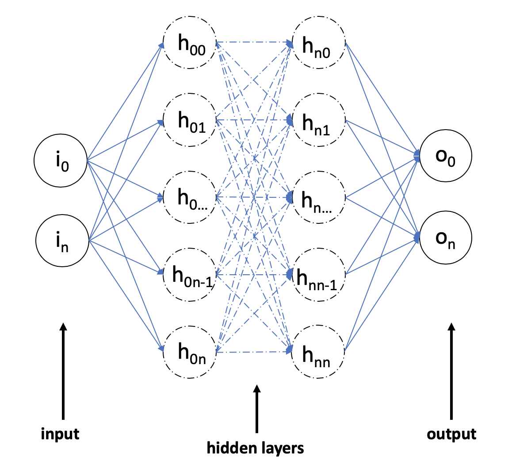

# nn-analysis-gui

Network Analysis GUI using the R network analysis tool from

# Getting up and running

## Download Docker

- [Docker](https://www.docker.com/get-started)

### Docker commands

- `docker-compose up`
  - This runs the `docker-compose.yml` file
- `docker-compose -f docker-compose.prod.yml up`
  - This runs docker compose on the `docker-compose.prod.yml up` file
- `ctrl + c`
  - This exits docker
- `docker-compose down`
  - This stops docker and removes the containers

## Start the project
When you run the project for the first time, run 
- `docker-compuse up`

## Run the project 
When you run the project any following time, it will work if you run
- `docker-compuse up`
However, if you make any changes to the Dockerfile or requirements.txt, run 
- `docker-compuse up --build`
to update the Docker image. 

# File Compatibility
Example network structure .txt files can be found in [nn-analysis-gui/testfiles](https://github.com/acuddeback/nn-analysis-gui/tree/master/testfiles). 

## File Structure
Consider a network with structure input &rarr; h<sub>0</sub> &rarr; ... &rarr; h<sub>n</sub> &rarr; output. 


<!-- 
The file structure is: \
b<sub>0</sub>, W<sub>00</sub>, ..., W<sub>0m</sub>, ... b<sub>n</sub>, W<sub>n0</sub>, ..., W<sub>nm</sub> \
dim(input), dim(h<sub>0</sub>), ..., dim(h<sub>n</sub>), dim(output)
in_labelh<sub>0</sub>, ..., in_labelh<sub>n</sub> \
out_labelh<sub>0</sub>, ..., out_labelh<sub>n</sub>

## Example
For a 2 &rarr; 5 &rarr; 5 &rarr; 2 network structure with the following attributes,
```
Weight 1: 
 [[ 2.53628473 -0.23776519  0.98759526  3.459617    2.69807113 -2.99712999]
 [ 0.90835687 -1.34079397 -1.17631845 -0.20097237 -0.74895765  1.86597283]]
Weight 2: 
 [[ 0.52631303 -0.75443375 -0.09307651 -0.33498976  2.01750351 -1.40244309]
 [-0.37592094 -2.70932653 -6.11536788  0.30836231  0.71243657 -2.48836893]
 [ 3.53932078 -3.90895664 -0.91026242 -1.37432825  2.06139464  1.93897125]
 [-0.68579135 -0.24156456 -2.75735861 -4.96403366 -1.66779207 -0.67839075]
 [ 1.46307032  1.40619551 -1.7625365  -1.60593712 -3.07702075 -3.83562512]
 [-4.41377922  2.90065569 -2.02659348 -1.87554863 -3.51913096  0.55348152]]
Weight 3: 
 [[-0.02481565 -0.55371162]
 [-0.66213899 -0.79917156]
 [ 0.32408215 -0.73505707]
 [-0.67793949 -0.19144545]
 [ 0.61879851 -0.7826095 ]
 [ 0.62388305 -0.75579642]]
Bias 1: 
 [[ 0.04953716  0.01260125 -0.05416709 -0.03981686  0.04267585 -0.08241209]]
Bias 2: 
 [[-0.00407873  0.00149515  0.01363634  0.00575915  0.02142709 -0.02860983]]
Bias 3: 
 [[ 0.02538573 -0.02538573]]
```
the corresponding text file would be
```


``` -->

# Acknowledgements
- This repository was built with subtantial help and guidance from [Chad Baily](https://github.com/chadbaily)
- The analysis package used in this gui is from [Marcus W. Beck](https://github.com/fawda123) and can be found [here](https://github.com/fawda123/NeuralNetTools).